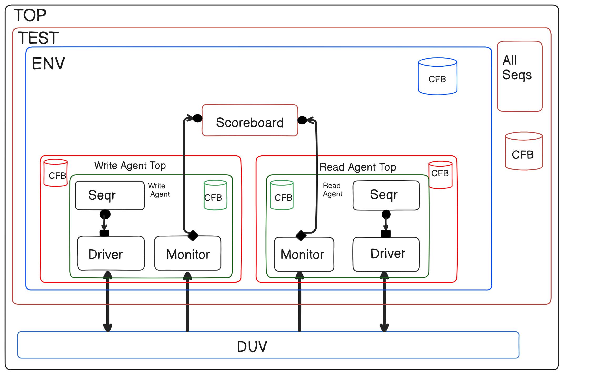

# FIFO UVM Verification

This repository contains a Universal Verification Methodology (UVM) environment for verifying a synchronous FIFO (First-In, First-Out) design. The FIFO circuit stores data in the order it is received and outputs it in the same order, ensuring smooth data flow between different parts of a system. This verification environment thoroughly tests all core functionalities of the FIFO, including read/write operations, full and empty conditions, and reset behavior.

---

## Project Overview

# FIFO Memory Project

This project implements a synchronous FIFO (First-In-First-Out) memory module with 8 entries, each 8 bits wide. It provides functionality for data writing, reading, and monitoring the full and empty conditions.

## Features

- **Data In/Out**: The FIFO stores data in the order it is written and outputs it in the same order when read.
- **Full/Empty Flags**: Flags to monitor when the FIFO is full or empty.
- **Write/Read Control**: Control signals to manage data writing and reading.
  
## Inputs and Outputs

### **Inputs:**
- **`data_in`**: The data input to the FIFO.
- **`clock`**: The clock signal that triggers FIFO operations.
- **`reset`**: Resets the FIFO and clears its memory.
- **`wn`**: Write enable signal. Data is written to the FIFO when `wn` is high.
- **`rn`**: Read enable signal. Data is read from the FIFO when `rn` is high.

### **Outputs:**
- **`data_out`**: The data output from the FIFO.
- **`full`**: The flag indicating that the FIFO is full.
- **`empty`**: The flag indicating that the FIFO is empty.

## Internal Signals

- **`wptr`**: Write pointer to track the position of the next data write.
- **`rptr`**: Read pointer to track the position of the next data read.
- **`memory`**: The FIFO memory, consisting of 8 entries, each 8 bits wide.

## Behavior

### **Write:**
- Data is written to the FIFO when `wn` is high and `full` is low.

### **Read:**
- Data is read from the FIFO when `rn` is high and `empty` is low.

### **Full Condition:**
- The FIFO is full when `wptr[2:1] == rptr[2:1]` and `wptr[0] != rptr[0]`.

### **Empty Condition:**
- The FIFO is empty when `wptr == rptr`.

## Clocking
- The FIFO operates synchronously, triggered on the positive edge of the `clock` signal.

## Memory
- The FIFO has 8 entries, each 8 bits wide.

## TB Architecture 

---

## Features Verified

1. **Basic Read/Write Operations:**  
   Ensure data integrity during standard operations.

2. **Full and Empty Conditions:**  
   Verify the correctness of `full` and `empty` flags under different conditions.

3. **Reset Behavior:**  
   Confirm that the FIFO resets correctly, clearing all data and resetting pointers.

4. **Pointer Management:**  
   Test correct functioning and wraparound of read/write pointers.

5. **Stress Testing:**  
   Assess performance and reliability during continuous read/write cycles.

---

## RTL Specifications

- **Data Width:** 8 bits  
- **Depth:** 16 entries  
- **Clock Domain:** Single, synchronous  
- **Control Signals:**  
  - **Read Enable (rd_en)**  
  - **Write Enable (wr_en)**  
- **Status Indicators:** Full and empty flags  
- **Pointer Size:** 5-bit read/write pointers (4-bit addressing, 1-bit wrap control)  

---

## Verification Environment Components

### Testbench Structure:
- **Driver & Sequencer:** Generates and sends test stimuli to the DUT (Design Under Test).  
- **Monitor:** Captures and logs transactions for analysis.  
- **Scoreboard:** Compares actual and expected outputs, ensuring data integrity.  
- **Coverage Collector:** Monitors functional and code coverage metrics.  

### Test Cases:
* 1. Basic Tests
* 2. Reset test
* 3. Single write/read
* 4. Corner Cases
* Full FIFO write attempt
* Empty FIFO read attempt
* Pointer wraparound
* Back-to-back operations
---

## Getting Started

### Prerequisites:
- **UVM Framework:** Installed and configured in your simulation environment.  
- **Simulation Tools:** Mentor QuestaSim, Synopsys VCS, or any UVM-compatible simulator.  

### Running the Tests:

```
# Go to the make file for more information
cd sim
make clean
make regress # run all the test
```
## Directory Structure
```
FIFO_UVM/
├── read_agt_top/
│   ├── read_agt.sv
│   ├── read_driver.sv
│   ├── read_monitor.sv
│   ├── read_xtn.sv
│   ├── read_seqs.sv
│   └── read_seqr.sv
├──write_agt_top/
│   ├── write_agt.sv
│   ├── write_driver.sv
│   ├── write_monitor.sv
│   ├── write_xtn.sv
│   ├── write_seqs.sv
│   └── write_seqr.sv
├── tb/
│   ├── env.sv
│   ├── top.sv
│   ├── scoreboard.sv
├── test/
│   ├── base_test.sv
│   └── router_pkg.sv
├── rtl/
│   └── fifo.sv
├── sim/
│   ├── Makefile
│   └── run.do
└── README.md

```
---

## Results
* All test scenarios passing
* Coverage goals met
* Assertion checks successful
* Detailed reports available in the reports directory

---
## Known Limitations
* Single clock domain only
* Fixed FIFO depth
---
## Contributors
- [TheRA1A](https://github.com/TheRA1A)
- [Kassa Keerthi](https://github.com/kassakeerthi)

### Contact
For questions or support, please reach out to [your_email@example.com].
